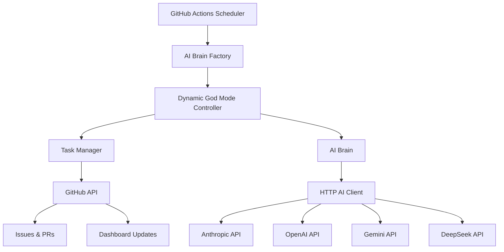

# CWMAI Integration Guide

## Overview

CWMAI (Code Web Mobile AI) is a 24/7 autonomous AI task management system that operates as a GitHub Actions-based workflow. This system does not expose REST API endpoints, but instead integrates with multiple external APIs and GitHub to manage development tasks autonomously.

## Architecture

### System Components



### Core Components

| Component | File | Purpose |
|-----------|------|---------|
| **AI Brain Factory** | `ai_brain_factory.py` | Creates and configures AI brain instances |
| **HTTP AI Client** | `http_ai_client.py` | Handles all external AI API communications |
| **Task Manager** | `task_manager.py` | Creates and manages GitHub issues with @claude mentions |
| **Dynamic Controller** | `dynamic_god_mode_controller.py` | Orchestrates the entire system operation |
| **Task Analyzer** | `task_analyzer.py` | Analyzes GitHub issues and task completion |

## External API Integrations

### 1. Anthropic Claude API

**Primary AI Provider for Task Orchestration**

- **Endpoint**: `https://api.anthropic.com/v1/messages`
- **Model**: `claude-3-7-sonnet-20250219`
- **Authentication**: API Key via `x-api-key` header
- **Max Tokens**: 4000

**Request Format:**
```json
{
  "model": "claude-3-7-sonnet-20250219",
  "max_tokens": 4000,
  "messages": [
    {
      "role": "user",
      "content": "Your prompt here"
    }
  ]
}
```

**Headers:**
```http
x-api-key: YOUR_ANTHROPIC_API_KEY
anthropic-version: 2023-06-01
content-type: application/json
```

### 2. OpenAI GPT API

**Secondary AI Provider (Fallback)**

- **Endpoint**: `https://api.openai.com/v1/chat/completions`
- **Model**: `gpt-4o`
- **Authentication**: Bearer token
- **Max Tokens**: 4000

**Request Format:**
```json
{
  "model": "gpt-4o",
  "messages": [
    {
      "role": "user",
      "content": "Your prompt here"
    }
  ],
  "max_tokens": 4000,
  "temperature": 0.7
}
```

**Headers:**
```http
Authorization: Bearer YOUR_OPENAI_API_KEY
Content-Type: application/json
```

### 3. Google Gemini API

**Research AI Provider**

- **Endpoint**: `https://generativelanguage.googleapis.com/v1beta/models/gemini-2.0-flash-001:generateContent`
- **Authentication**: API Key via query parameter
- **Model**: `gemini-2.0-flash-001`

**Request Format:**
```json
{
  "contents": [
    {
      "parts": [
        {
          "text": "Your prompt here"
        }
      ]
    }
  ]
}
```

**URL Format:**
```
https://generativelanguage.googleapis.com/v1beta/models/gemini-2.0-flash-001:generateContent?key=YOUR_GEMINI_API_KEY
```

### 4. DeepSeek API

**Research AI Provider**

- **Endpoint**: `https://api.deepseek.com/chat/completions`
- **Model**: `deepseek-chat`
- **Authentication**: Bearer token
- **Compatible with OpenAI format**

**Request Format:**
```json
{
  "model": "deepseek-chat",
  "messages": [
    {
      "role": "user",
      "content": "Your prompt here"
    }
  ],
  "max_tokens": 4000,
  "temperature": 0.7
}
```

## GitHub Integration

### API Usage Patterns

The system uses GitHub's REST API extensively for:

#### 1. Issue Management

**Creating Issues:**
```http
POST /repos/{owner}/{repo}/issues
```

**Request Body:**
```json
{
  "title": "Generated Task Title",
  "body": "Task description with @claude mention",
  "labels": ["ai-generated", "priority-medium"],
  "assignees": ["claude"]
}
```

#### 2. Dashboard Updates

**Updating Issue Comments:**
```http
PATCH /repos/{owner}/{repo}/issues/comments/{comment_id}
```

#### 3. Repository Analysis

**Getting Issues:**
```http
GET /repos/{owner}/{repo}/issues?state=all&per_page=100
```

**Getting Pull Requests:**
```http
GET /repos/{owner}/{repo}/pulls?state=all&per_page=100
```

## Configuration

### Environment Variables

| Variable | Required | Description |
|----------|----------|-------------|
| `ANTHROPIC_API_KEY` | Yes | Primary AI provider for task orchestration |
| `GITHUB_TOKEN` or `CLAUDE_PAT` | Yes | GitHub API access for issue management |
| `OPENAI_API_KEY` | Optional | Fallback AI provider |
| `GEMINI_API_KEY` | Optional | Research AI provider |
| `DEEPSEEK_API_KEY` | Optional | Research AI provider |

### Intensity Levels

The system supports different intensity levels:

```python
class IntensityLevel:
    CONSERVATIVE = "conservative"  # Careful, validated actions
    BALANCED = "balanced"         # Normal operation (recommended)
    AGGRESSIVE = "aggressive"     # Maximum capability utilization
    EXPERIMENTAL = "experimental" # Cutting-edge, higher risk
```

## Usage Examples

### 1. HTTP AI Client Usage

```python
from scripts.http_ai_client import HTTPAIClient

# Initialize client
client = HTTPAIClient()

# Generate response with specific model
response = await client.generate_enhanced_response(
    prompt="Analyze this code for security issues",
    model="claude"  # or "gpt", "gemini", "deepseek"
)

print(response['content'])
print(f"Provider: {response['provider']}")
print(f"Confidence: {response['confidence']}")
```

### 2. Synchronous Usage

```python
# For synchronous code
response = client.generate_enhanced_response_sync(
    prompt="Create a new feature specification",
    model="gemini"
)
```

### 3. Research AI Analysis

```python
# Analyze content with research AI
result = client.analyze_with_research_ai(
    content="Market analysis data...",
    analysis_type="market"
)
```

### 4. Provider Status Check

```python
# Check available providers
status = client.get_research_ai_status()
capabilities = client.get_research_capabilities()

print(f"Available providers: {capabilities['total_providers']}")
print(f"Primary provider: {capabilities['primary_provider']}")
```

## System Operation Flow

### 1. Scheduled Execution

```yaml
# GitHub Actions triggers every 30 minutes
schedule:
  - cron: '*/30 * * * *'
```

### 2. Decision Cycle

1. **Analysis Phase**
   - Scan GitHub issues and @claude interactions
   - Identify gaps, bottlenecks, and opportunities
   - Review completed work quality

2. **Decision Phase**
   - AI Brain determines optimal action:
     - Generate new tasks
     - Review completed tasks
     - Prioritize backlog
     - Update dashboard

3. **Execution Phase**
   - Create GitHub issues with @claude mentions
   - Update task priorities and dependencies
   - Update live dashboard

### 3. Task Types Generated

- **New Projects**: Full applications using Laravel React starter kit
- **Features**: New functionality with detailed specifications
- **Bug Fixes**: Issues with reproduction steps
- **Documentation**: API docs, guides, technical writing
- **Testing**: Unit, integration, E2E test suites
- **Security**: Vulnerability assessments and fixes
- **Performance**: Optimization tasks with benchmarks

## Integration Best Practices

### 1. API Rate Limiting

All external API calls include:
- Request tracking with unique IDs
- Timeout handling (30 seconds)
- Error logging and fallback responses
- Response time monitoring

### 2. Error Handling

```python
# Standard error response format
{
    'content': 'Error message',
    'provider': 'provider_name',
    'error': 'Detailed error description',
    'confidence': 0.0,
    'request_id': 'req_123',
    'response_time': 1.23,
    'timestamp': '2025-06-09T15:00:00Z'
}
```

### 3. Security Practices

- API keys stored in environment variables
- Headers sanitized in logs (keys replaced with `***`)
- No sensitive data in repository
- Timeout protection on all HTTP requests

### 4. Monitoring

The system tracks:
- Request count and response times
- Error rates by provider
- Success rates and confidence scores
- Provider availability status

## Troubleshooting

### Common Issues

#### 1. No AI Providers Available

**Problem:** All API keys missing or invalid
**Solution:** 
```bash
# Check environment variables
echo $ANTHROPIC_API_KEY
echo $OPENAI_API_KEY
echo $GEMINI_API_KEY
echo $DEEPSEEK_API_KEY
```

#### 2. GitHub API Rate Limiting

**Problem:** Hitting GitHub API rate limits
**Solution:** 
- Use GitHub App authentication instead of personal tokens
- Implement exponential backoff
- Cache responses where possible

#### 3. API Timeout Issues

**Problem:** External APIs timing out
**Solution:**
- Increase timeout values
- Implement retry logic with exponential backoff
- Use fallback providers

#### 4. Provider Selection Issues

**Problem:** Wrong AI provider being selected
**Solution:**
```python
# Force specific provider
response = await client.generate_enhanced_response(
    prompt="Your prompt",
    model="claude"  # Explicitly specify provider
)
```

### Debug Mode

Enable debug logging:
```python
client.debug_mode = True
```

This provides detailed logging of:
- Request/response payloads
- API call durations
- Provider selection logic
- Error tracebacks

### Monitoring Dashboard

The system maintains a live dashboard showing:
- Task status distribution
- Performance metrics
- @claude interaction effectiveness
- System health indicators
- Recent activity logs

Access via the "📊 AI Task Management Dashboard" GitHub issue.

## API Response Formats

### Standard Response Structure

All AI provider responses are normalized to:

```json
{
  "content": "Generated response text",
  "provider": "anthropic|openai|gemini|deepseek",
  "model": "specific-model-name",
  "confidence": 0.9,
  "usage": {
    "prompt_tokens": 100,
    "completion_tokens": 200,
    "total_tokens": 300
  },
  "request_id": "req_123",
  "response_time": 1.23,
  "timestamp": "2025-06-09T15:00:00Z"
}
```

### Error Response Structure

```json
{
  "content": "Error description",
  "provider": "provider_name",
  "error": "Detailed error message",
  "confidence": 0.0,
  "request_id": "req_123",
  "response_time": 1.23,
  "timestamp": "2025-06-09T15:00:00Z"
}
```

## Advanced Configuration

### Custom God Mode Configuration

```python
from scripts.god_mode_controller import GodModeConfig, IntensityLevel

config = GodModeConfig(
    intensity=IntensityLevel.BALANCED,
    enable_self_modification=False,  # Safety first
    enable_multi_repo=True,
    enable_predictive=True,
    enable_quantum=False,
    max_parallel_operations=3
)
```

### Provider Priority Configuration

```python
# Provider fallback order
priority_order = ['anthropic', 'openai', 'gemini', 'deepseek']

# Check provider availability
available_providers = [
    provider for provider in priority_order 
    if client.providers_available[provider]
]
```

## Support

For issues and questions:
- Check the GitHub Issues for common problems
- Review the monitoring dashboard for system status
- Enable debug mode for detailed logging
- Contact the development team via GitHub Issues

---

*This documentation covers the CWMAI system's integration patterns and external API usage. The system is designed to operate autonomously within the GitHub ecosystem.*